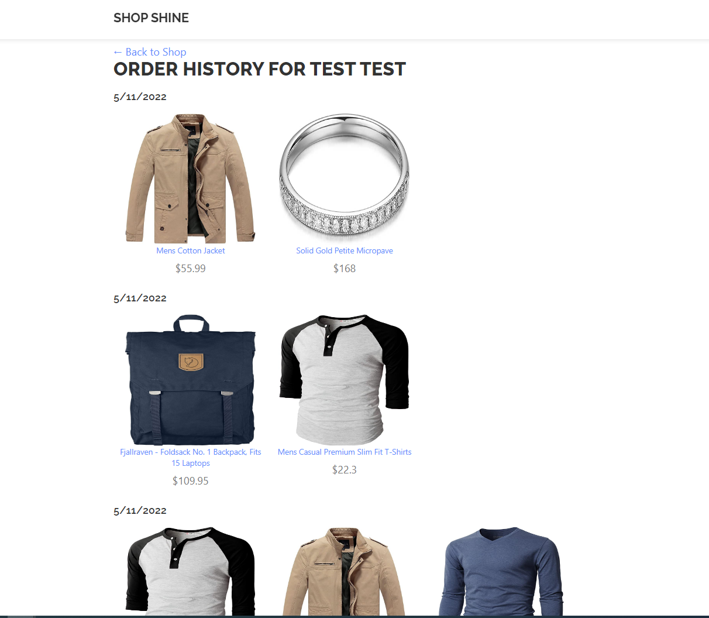
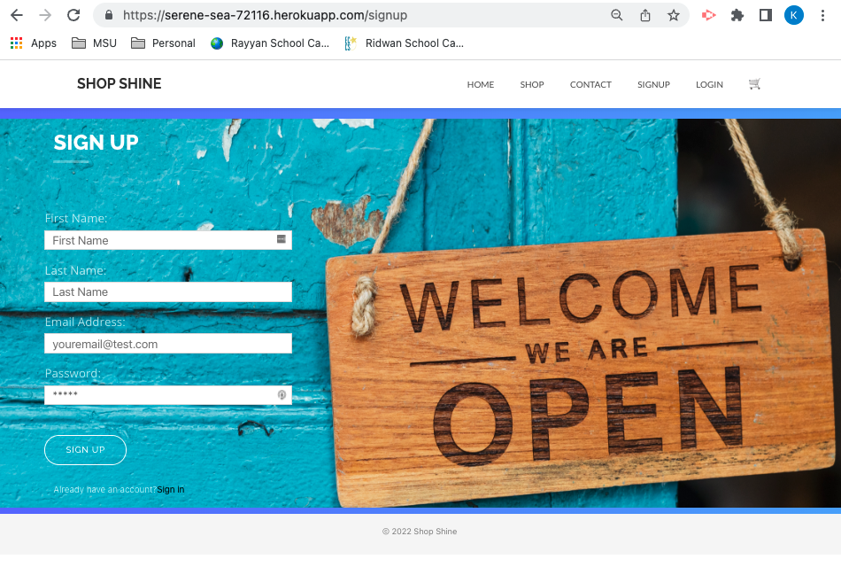
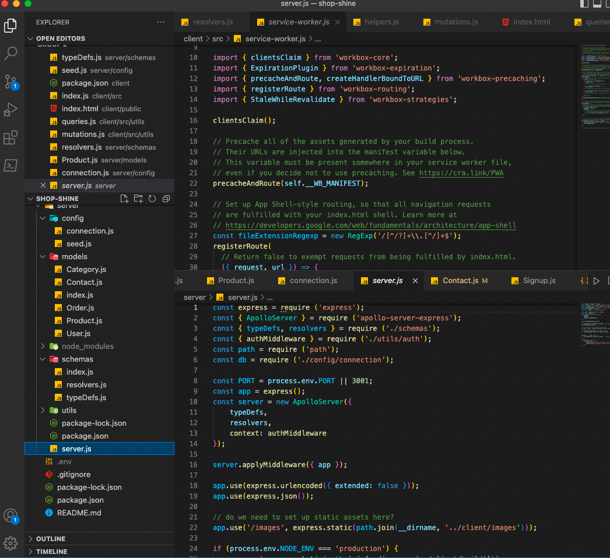

# SHOP-SHINE

## Table of contents

1. [Title](#title)
2. [Description](#description)
3. [Technologies](#technologies-used-on-this-project)
4. [Installation](#installation)
5. [Usage](#usage)
6. [Contributing](#contributing)
7. [Test](#test)
8. [License](#license)
9. [Questions](#questions)
10. [Deployed Application](#deployed-application)

## Title

SHOP-SHINE

## Description

Online shopping site

## Technologies used on this project

`MonGODB, Express, React, Node.js, Mongoose, JWT, Bootstrap, MaterialUI Javascript, HTML, CSS`

## Installation

`Clone the repository and run npm install and npm run develop to start application locally`

## Usage

`On application starts locally application can be acccess using http://localhost:3000 and also Apollo GraphQL can be access via http://localhost:3001 to intract with MongoDB(in this case)`

## Contributing

`Clone repository, create your own branch and do a pull request against main`

## Test

`Test on local environment`

## License

[MIT](https://gist.github.com/nicolasdao/a7adda51f2f185e8d2700e1573d8a633#mit-license)

## Questions

Find us on Github  
[rpkrupali1](https://github.com/rpkrupali1)  
[favro03](https://github.com/favro03)  
[Mike2481](https://github.com/Mike2481)  
[kazichaska](https://github.com/kazichaska)  

## Deployed Application

https://serene-sea-72116.herokuapp.com/

Please find below details of application:

When user lands on home page, user sees an option to shop or shop by category

When users clicks on shop from without filtering, user can see all products

User can filter products by category

When user add items to cart, shopping cart on header will show product quantity

When user clicks on cart, all items from cart will be displayed with total amount. If amount is more than 100 then 10% discount will be applied (User can only checkout if logged in)

Cart with discount

cart without discount

Upon checkout user can provide card details and checkout

Once checkout is completed successfully user will be navigated to success page and has an option to continue shopping

And orders will be added in order history

User can Login , logout and forgot password

## Screenshots of the code and application

